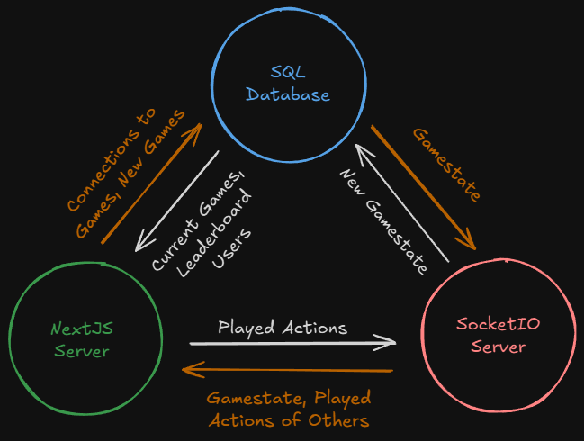

# Haggle
A NextJS, online card game perfect for ruining friendships.

## 1. How to use
First, contact me for the `.env.local` file and add it to the root directory of the project.

Then, in the root directory, run these commands to install the necessary NodeJS packages and start the web server, respectively:
```
pnpm i
pnpm dev
```

## 2. Planned layout

<p align="center">
    
</p>

### i. Page Routes

Here are the planned routes for the different pages:

- `/`
    - nav bar to `/play`, `/rules`, and `/`
    - invite player to sign in
    - about

- `/rules`
    - nav bar to `/play`, `/rules`, and `/`
    - explains the game
        - plenty of visuals?

- `/play`
    - nav bar to `/play`, `/rules`, and `/`
    - can play offline OR online w/o signing in
        - playing online w/o signing in doesn't update leaderboard
        - user can set anonymous username with sessionStorage API
    - public leaderboards
        - fetch all users
    - if signed in:
        - show where they are in leaderboard
            - check if user in list matches Auth0 email
            - if so, make a dynamic HTML anchor/link pair
    - show cames to play as links
        - hyperlink elements link to `/play/online/[gameTitle]`
        - fetch games that aren't full nor private
            - display number of users already in game
        - reload button
    - create new game
        - open form that takes in gameTitle

- `/play/offline`
    - user can play a game locally
    - <b>single player should be implemented first</b>

- `/play/online/[gameTitle]`
    - upon leaving game, terminate game
    - check whitelist if private game
    - check for for full game when joining
        - <b>if filled game, possibly implement spectator mode</b>

### ii. Models

We'll be using Sequelize as the ORM, but here's the models:

> <hr>
> <h3>User</h3>
>
> | Field | Datatype | Constraints | Justification |
> | -------- | ------- | ------- | ----- |
> | `username` | `string` | unique, required | The display name during games |
> | `email` | `string` | unique, required | Needed for Auth0-based lookups |
> | `whitelist_default` | `User[]` | required, can be empty | Allow certain users private games by default |
<br>


> <hr>
> <h3>Game</h3>
>
> | Field | Datatype | Constraints | Justification |
> | -------- | ------- | ------- | ----- |
> | `gameTitle` | `string` | unique, required | Needed for API and page access |
> | `players` | `string` | required, can be empty | Signed in players to update after game |
> | `numPlayers` | `number` | required | Number of players in game |
> | `private` | `bool` | required | If true, only allows signed in, whitelisted players |
> | `whitelist` | `User[]` | can be empty | Allow certain users private games by default |
> | `state` | `string` | required, CANNOT be empty | Current state of game |


### iii. API Routes

- `/users`
- `/games?allow_full=false`
